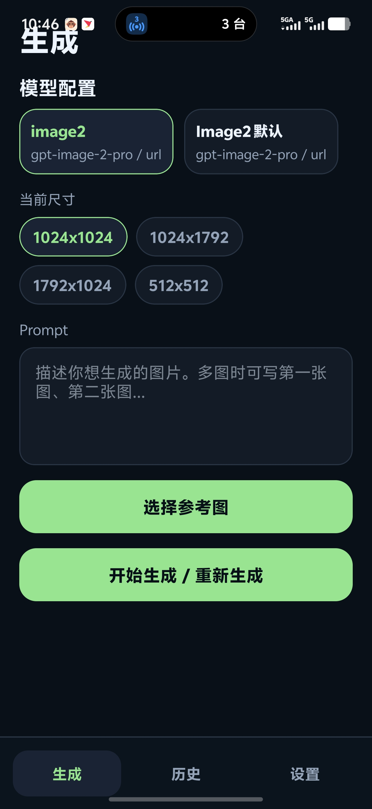
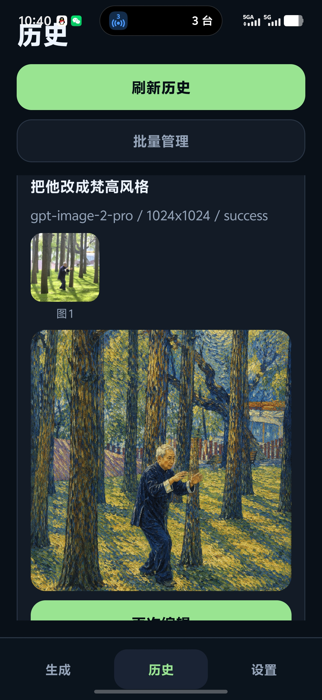
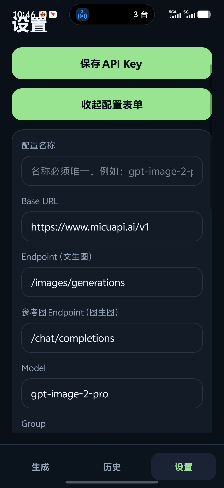

# image2ForAndroid

一款在 Android 上运行的 AI 作图客户端，通过 OpenAI 兼容接口调用 [micuapi](https://www.micuapi.ai/) 等中转站，支持文生图、多图参考生图、本地历史与相册导出。

## Demo

> 将截图放入 `docs/images/` 后，可替换下方占位说明。

| 生成页 | 历史页 | 设置页 |
|--------|--------|--------|
|  | |  |

## Background

- 需要在手机上快速调用 Image2 / GPT 图像类模型，又不想每次手写 curl 或依赖网页。
- 文生图与图生图使用的 **endpoint 不同**（`/images/generations` vs `/chat/completions`），先在本地网页 (`index.html` + `app.js`) 验证请求格式后，再实现 App。
- 第一版 **不依赖自建后端**：`baseUrl`、`API Key`、模型参数均由用户在 App 内配置，结果保存在本地。

## Features

- **文生图**：纯文本 prompt，走 `baseUrl + /images/generations`。
- **多图图生图**：从相册选择多张 PNG/JPEG 参考图，按顺序编号（图 1、图 2…），走 `baseUrl + /chat/completions`，以 `data:image/...;base64,...` 传入 `messages`。
- **模型配置**：多套 `baseUrl` / endpoint / model / size / group / stream 配置，生成页一键切换。
- **重新生成**：支持修改 prompt 或参数后再次生成；新请求会自动取消未完成的旧请求。
- **本地历史**：SQLite 持久化 prompt、参数、输入/输出图；支持单条删除、批量选择删除（含全选）。
- **相册导出**：生成图先存 App 私有目录，用户点击后再导出到系统相册。
- **调试日志**：记录请求 URL、模式、图片顺序、响应摘要；同步输出到 Metro 终端（`[Image2 请求日志]`）。
- **本地 API 测试器**：`index.html` 可在浏览器中试验文生图 / 图生图请求格式（受 CORS 限制时可用 curl）。

## Tech Stack

- [React Native](https://reactnative.dev/) `0.85`
- [Expo](https://expo.dev/) `56`
- [TypeScript](https://www.typescriptlang.org/)
- [Zustand](https://github.com/pmndrs/zustand) — 全局状态
- [expo-sqlite](https://docs.expo.dev/versions/latest/sdk/sqlite/) — 历史记录
- [expo-secure-store](https://docs.expo.dev/versions/latest/sdk/securestore/) — API Key 加密存储
- [expo-image-picker](https://docs.expo.dev/versions/latest/sdk/imagepicker/) / [expo-file-system](https://docs.expo.dev/versions/latest/sdk/filesystem/) / [expo-media-library](https://docs.expo.dev/versions/latest/sdk/medialibrary/)
- [Vitest](https://vitest.dev/) — 请求构建与响应解析单元测试

## Project Structure

```text
image2ForAndroid/
├── App.tsx                 # 根组件与 Tab 导航
├── app.json                # Expo 配置
├── index.html              # 浏览器端 API 测试页
├── app.js                  # 测试页请求逻辑（与 App 对齐）
├── src/
│   ├── api/
│   │   ├── openAiImageProvider.ts   # 请求构建、发送、响应解析
│   │   └── openAiImageProvider.test.ts
│   ├── security/
│   │   └── credentialStore.ts     # API Key / 模型配置持久化
│   ├── storage/
│   │   ├── historyStore.ts          # 历史记录 SQLite
│   │   └── imageStorage.ts          # 输出图本地存储与相册导出
│   ├── tasks/
│   │   └── generationTaskManager.ts # 生成任务与取消
│   ├── store/
│   │   └── useAppStore.ts           # Zustand 状态
│   ├── ui/
│   │   ├── GenerateScreen.tsx       # 生成页
│   │   ├── HistoryScreen.tsx        # 历史页（含批量删除）
│   │   ├── ConfigScreen.tsx         # 设置页
│   │   └── components.tsx           # 通用 UI
│   └── types.ts                     # 类型与默认配置
└── test/                            # 本地静态资源（如 test.png）
```

## Installation

环境要求：

- Node.js **20.19.4+**（Metro / RN 推荐版本）
- npm **10+**
- Android 真机安装 [Expo Go](https://expo.dev/go)，或 Android Studio 模拟器

```bash
git clone <your-repo-url>
cd image2ForAndroid
npm install
```

## Environment Variables

本项目 **不使用** `.env` 环境变量。敏感信息与接口地址均在 App 内配置：

| 配置项 | 说明 | 存储位置 |
|--------|------|----------|
| API Key | 中转站密钥 | `expo-secure-store`（加密） |
| Base URL | 如 `https://www.micuapi.ai/v1` | 模型配置（SecureStore + 内存） |
| Endpoint（文生图） | 默认 `/images/generations` | 模型配置 |
| 参考图 Endpoint | 默认 `/chat/completions` | 模型配置 |
| Model / Size / Group / Stream 等 | 生成参数 | 模型配置 |

> API Key **不会**写入历史记录或调试日志明文。

### micuapi 推荐配置示例

| 字段 | 建议值 |
|------|--------|
| Base URL | `https://www.micuapi.ai/v1` |
| Endpoint（文生图） | `/images/generations` |
| 参考图 Endpoint | `/chat/completions` |
| Model | `gpt-image-2-pro` |
| Group | `vip_2_image` |
| Stream | `true`（SSE 响应需从 markdown 中提取图片 URL） |

## Run

启动开发服务：

```bash
npm start
```

- 使用 Expo Go 扫描终端二维码，或执行 `npm run android` 打开模拟器。

验证：

```bash
npm test
npm run typecheck
```

浏览器测试页（需自行用静态服务器打开 `index.html`，或直接打开文件）：

```bash
# 示例：用 npx 起一个本地静态服务
npx serve .
# 访问 index.html
```

## API 说明（简要）

### 文生图

```http
POST {baseUrl}/images/generations
Authorization: Bearer {apiKey}
Content-Type: application/json
```

```json
{
  "model": "gpt-image-2-pro",
  "prompt": "一只穿宇航服的橘猫",
  "size": "1024x1024",
  "n": 1,
  "response_format": "url"
}
```

### 图生图（多模态 Chat）

```http
POST {baseUrl}/chat/completions
Authorization: Bearer {apiKey}
Content-Type: application/json
```

请求体包含 `messages[].content` 中的 `text` 与 `image_url`（`data:image/png;base64,...`）。App **仅使用 JSON**，不使用 `multipart/form-data` 或 `file://` 传图。

### 响应示例

```json
{
  "created": 1780407223,
  "data": [{ "url": "https://example.com/output.png" }],
  "usage": { "total_tokens": 811 }
}
```

## Android 打包与部署

开发阶段用 **Expo Go** 即可；要装到真机、内部分发或上架 Google Play，需要打出 **独立 APK/AAB**（本项目含原生模块：`expo-sqlite`、`expo-secure-store` 等，不能只用 Expo Go 发布）。

### 方式一：EAS Build（推荐，云端打包）

1. **注册 Expo 账号**  
   https://expo.dev/signup

2. **安装 EAS CLI 并登录**

   ```bash
   npm install -g eas-cli
   eas login
   ```

3. **关联项目（首次）**

   ```bash
   cd image2ForAndroid
   eas init
   ```

   仓库已包含 `eas.json`，可直接构建。

4. **准备应用图标（首次上架建议做）**

   在项目根目录增加资源（至少 1024×1024 图标），并在 `app.json` 中配置，例如：

   ```json
   "icon": "./assets/icon.png",
   "splash": { "image": "./assets/splash.png", "resizeMode": "contain", "backgroundColor": "#071018" }
   ```

   没有图标时部分构建仍可能通过，但上架商店通常要求完整资源。

5. **构建安装包**

   | 用途 | 命令 | 产物 |
   |------|------|------|
   | 内测 / 侧载安装 | `eas build -p android --profile preview` | **APK**，可直接发给用户安装 |
   | Google Play 上架 | `eas build -p android --profile production` | **AAB**，用于商店提交 |

   首次构建会提示创建 **Android Keystore**（用于签名），选让 Expo 托管即可。

6. **下载与安装**

   - 构建结束后终端会给出下载链接，或在 https://expo.dev 项目页的 **Builds** 中下载。
   - APK：传到手机安装（需允许「未知来源」）。
   - AAB：用 [Google Play Console](https://play.google.com/console) 上传，不能直接在手机安装。

7. **（可选）提交商店**

   ```bash
   eas submit -p android --profile production
   ```

   需配置 Google Play 服务账号密钥，见 [EAS Submit 文档](https://docs.expo.dev/submit/introduction/)。

### 方式二：本地构建（需 Android Studio）

适合已有 Android 开发环境、希望完全本地出包的情况。

```bash
npm install
npx expo prebuild --platform android   # 生成 android/ 原生工程
cd android
./gradlew assembleRelease              # Windows: gradlew.bat assembleRelease
```

- Release APK 一般在：`android/app/build/outputs/apk/release/`
- 本地 Release 需自行配置签名（`android/app/build.gradle` + keystore），见 [Expo 本地构建说明](https://docs.expo.dev/guides/local-app-development/)。

### 部署前检查清单

- [ ] `app.json` 里 `android.package` 已为最终包名（当前：`com.pageplug.image2forandroid`）
- [ ] `version` / `versionCode` 按发版递增（可用 `eas.json` 的 `appVersionSource: remote` 在 Expo 控制台管理）
- [ ] 相册、选图权限文案已在 `app.json` plugins 中配置
- [ ] 在 **Release 包** 上实测：文生图、参考图、历史、删除、导出相册
- [ ] API Key 由用户在 App 内填写，无需打进安装包

### 与 Expo Go 的区别

| | Expo Go | 独立 APK/AAB |
|--|---------|----------------|
| 安装 | 应用商店装 Expo Go，扫码开发 | 直接安装你的 App |
| 原生能力 | 受限 | 完整（SecureStore、SQLite 等） |
| 分发 | 仅开发 | 内测、企业、商店均可 |

## Roadmap

- [ ] 后端代理模式（隐藏 API Key）
- [ ] 账号登录与云端历史同步
- [ ] 多供应商 Provider 适配
- [ ] 图片压缩与超大图自动缩放
- [ ] HEIC/HEIF、RAW 等更多输入格式
- [ ] 局部重绘、蒙版与画布编辑
- [ ] 多任务队列与批量生成
- [ ] 正式 Android 开发构建（脱离 Expo Go 限制）

## License

MIT
