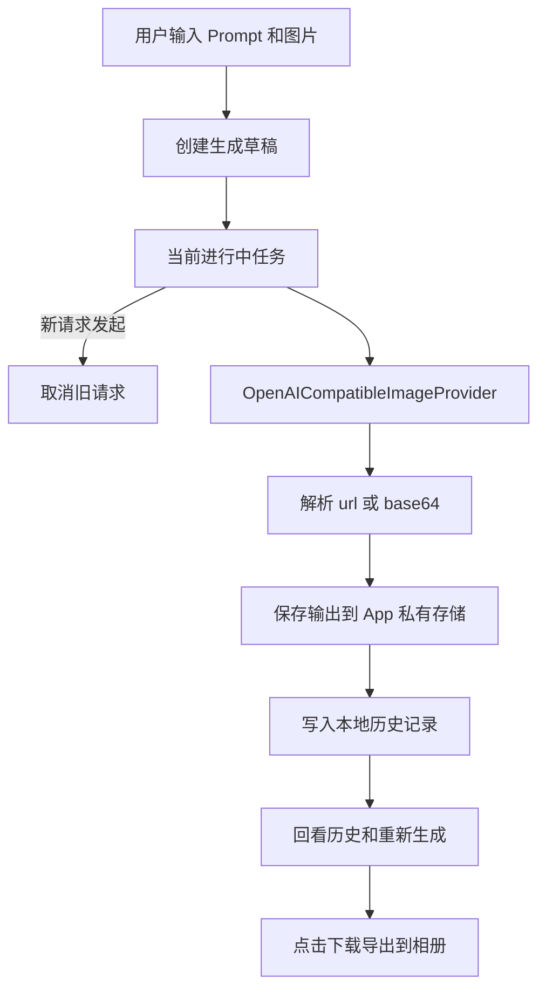

# image2ForAndroid
做一个用来调用image2来进行AI作图的软件
url:https://www.micuapi.ai/v1
TodoList:
1.问题:输入的图片问题;


针对请求响应格式的重难点，采取先写一个静态网页作为测试，测试出来一个符合要求的接口再去开发
测试结果,下面通过url版和base64都成功通过:
```
{
  "created": 1780407223,
  "data": [
    {
      "url": "https://oss.filenest.top/uploads/983xxxxxf70.png"
    }
  ],
  "usage": {
    "total_tokens": 811,
    "input_tokens": 46,
    "output_tokens": 765,
    "input_tokens_details": {
      "text_tokens": 46,
      "image_tokens": 0
    }
  }
}
```

## 技术选型:    
React Native + Expo

## RN + Expo 开发环境

推荐环境：

- Node.js `20.19.4+`。当前依赖中的 Metro/React Native 包要求该小版本以上；`20.19.0` 可以安装，但启动时如果遇到 Metro 异常，优先升级 Node。
- npm `10+`
- Android 真机安装 Expo Go，或使用 Android Studio 模拟器。

安装依赖：

```bash
npm install
```

启动开发服务：

```bash
npm start
```

启动后可以：

- 用 Expo Go 扫描终端里的二维码。
- 或运行 `npm run android` 打开 Android 模拟器。

验证命令：

```bash
npm test
npm run typecheck
```

当前 App 已包含三个页面：

- `生成`：输入 prompt、选择多张参考图、发起生成/重新生成。
- `历史`：查看本地历史、再次编辑、导出生成图到相册。
- `设置`：保存中转站 `baseUrl`、`endpoint`、`apiKey`、`model`、尺寸和响应格式。

设置页配置能力：

- `Response Format` 使用按钮二选一：`url` / `b64_json`。
- `Size` 使用常用尺寸按钮选择：`1024x1024`、`1024x1792`、`1792x1024`、`512x512`。
- `Model` 可以手动输入，也可以从常用模型按钮选择。
- 可以保存多个模型配置，每个配置包含 `baseUrl`、`endpoint`、`model`、`size`、`responseFormat`。
- 直接点击保存会新增一条配置。
- 配置名称作为唯一索引，新增时如果重名会拒绝保存。
- 点击 `配置` 才展开新增配置表单；保存后表单会清空并收起。
- 点击已保存配置的 `修改` 后才展开编辑表单，再保存会更新当前这条配置。
- 点击已保存配置的 `使用` 只会切换当前生成配置，不进入编辑状态。
- 模型列表包含 `gpt-image-2-pro`、`gpt-image-2`、`image2`、`gpt-image-1`、`dall-e-3`、`dall-e-2`。
- 参考图传输方式默认建议使用 `chat_messages`，对应中转站的 OpenAI Chat Completions 多模态格式。
- `json_base64` 和 `multipart` 保留为接口实验模式。
- API Key 仍然单独使用系统安全存储，不写入历史记录。
- API Key 可以单独保存，不需要展开配置表单。

生成页切换能力：

- 可以在顶部切换设置页保存过的模型配置。
- 可以在生成页直接切换当前尺寸。
- 切换模型配置会同步切换该配置保存的 endpoint、model、size 和 responseFormat。

生成页调试能力：

- 未选择参考图时，使用 JSON 请求，走文生图模式。
- 选择参考图后，默认使用 Chat Completions 多模态请求，把图片按 `messages[].content[].image_url.url = data:image/...;base64,...` 传给接口。
- 当前推荐 endpoint 是 `/chat/completions`，模型可用 `gpt-image-2-pro`，group 可用 `vip_2_image`。
- `stream=true` 时，App 会读取完整响应文本并从 SSE 片段中提取 assistant markdown 里的图片链接。
- `json_base64` 模式会把图片按 `input_images[].b64_json` 传给接口，仅作为兼容实验。
- 如果配置里选择 `multipart`，则使用 `multipart/form-data`，把图片文件按 `图 1 / 图 2 / 图 3` 顺序追加到 `image` 字段。
- 页面底部会显示调试日志，包括请求模式、请求地址、模型、图片数量和图片顺序。
- 调试日志可以点击展开，查看完整请求信息：请求地址、模型、尺寸、prompt、是否包含参考图、图片文件信息和 base64 长度。日志不会显示完整 API Key，也不会直接打印完整 base64 图片内容。
- 请求发送层会记录真实发送前的请求摘要，以及服务端响应状态、响应 Content-Type、响应原文前 2000 个字符。
- 如果选择了参考图但没有读取到 base64 图片内容，App 会阻止请求并报错，不会再悄悄发送一个没有图片内容的请求。
- 已选参考图支持上移、下移和删除。
- 当前输出下方可以直接点击下载，把生成图保存到系统相册。

注意：App 端已经会真实上传参考图文件，但中转站是否接受多图图生图取决于该接口本身。如果日志显示 `请求模式：multipart` 且图片数正确，但结果仍然不参考图片，需要确认当前模型和 endpoint 是否支持图生图/多图输入，必要时把 endpoint 改成中转站文档要求的图生图接口。

本地网页测试器支持多种图生图请求格式实验：

- `文生图 JSON`：不传参考图，验证基础接口。
- `图生图 Chat Messages`：使用 `messages[].content` 的 `text + image_url data URL`，这是当前中转站推荐格式。
- `图生图 Multipart`：使用 `multipart/form-data`，按 `image` 字段上传文件。
- `图生图 JSON base64`：使用 `input_images[].b64_json` 传图片内容。
- `图生图 JSON URL`：使用 `input_images[].url` 观察接口是否接受图片 URL。

如果 RN 端出现 `unsupported FormDataPart implementation`，通常是 React Native 当前运行时对 multipart 文件 part 的兼容问题。优先在设置页把参考图传输方式切到 `json_base64`，再测试 `图生图 JSON base64` 是否被中转站支持。

## MVP 目标

第一版目标是做一个可以独立运行的安卓端 AI 作图工具。用户在本地填写中转站 `baseUrl`、`apiKey` 和 `model` 后，可以完成文生图、多图图生图、结果回看和重新生成。

第一版不依赖后端服务。后端代理、账号系统和云端同步都放到后续阶段。

## 已确认需求

- 支持文生图。
- 支持多张本地图片作为图生图参考图。
- 多图输入必须保留顺序，用户可以在提示词中使用“第一张图”“第二张图”描述图片。
- 第一版上传图片格式只支持 PNG、JPG/JPEG、WEBP。
- 用户可以修改上一次的提示词和参数后重新生成。
- 如果上一次请求还在进行中，用户发起新请求时自动取消旧请求，只保留新请求作为当前任务。
- 历史记录需要本地持久化，下一次打开软件时不能丢失之前的提示词、参数、输入图片和输出结果。
- 生成结果先保存到 App 私有存储；用户点击下载时，再导出到系统相册。

## 第一版功能范围

### 1. 文生图

用户填写或选择以下配置：

- `baseUrl`：例如 `https://www.micuapi.ai/v1`
- `endpoint`：默认 `/images/generations`
- `apiKey`：用户自己的中转站 Key
- `model`：例如 `image2`
- `size`：例如 `1024x1024`
- `response_format`：`url` 或 `b64_json`

请求采用 OpenAI-compatible 风格：

```http
POST {baseUrl}{endpoint}
Authorization: Bearer {apiKey}
Content-Type: application/json
```

响应优先支持两种主流格式：

```json
{
  "data": [
    {
      "url": "https://example.com/image.png"
    }
  ]
}
```

```json
{
  "data": [
    {
      "b64_json": "base64-image-content"
    }
  ]
}
```

### 2. 多图图生图

用户可以从本地选择多张图片，App 按选择顺序生成稳定编号：

- 图 1
- 图 2
- 图 3

UI 需要明确显示每张图的编号和缩略图。用户写提示词时，可以直接使用“第一张图”“第二张图”这样的描述。

请求层必须保留图片顺序。每张输入图在内部表示为一个 `ImageInput`，包含：

- `index`：图片顺序，从 1 开始
- `localUri`：本地图片地址
- `mimeType`：`image/png`、`image/jpeg` 或 `image/webp`
- `displayName`：可选，用于 UI 展示
- `processedPath`：可选，压缩或转码后的临时文件路径

如果当前中转站或模型不支持多图图生图，Provider 层需要返回明确错误，提示用户当前模型不支持该能力。

### 3. 修改提示词与重新生成

重新生成不是“复用一次旧 HTTP 请求”，而是基于上一次参数创建一个新生成任务。

规则：

- 用户可以从当前结果或历史记录进入“再次编辑”。
- 再次编辑时自动带回上次的 prompt、模型、尺寸、响应格式和输入图片顺序。
- 用户修改 prompt 或参数后点击重新生成。
- 如果旧任务还在请求中，App 自动取消旧任务。
- 被取消的旧任务不作为有效结果保存。
- 如果旧任务已经完成，则旧结果继续保留在历史中，新请求成功后保存为新的历史项。
- 取消记录可以保留状态用于排查，但不能覆盖上一次成功结果，也不能出现在“成功生成结果”列表中。

### 4. 本地历史记录

历史记录必须跨 App 重启保留。建议使用本地数据库保存元数据，图片文件保存到 App 私有存储。

每条历史记录至少保存：

- `id`
- `prompt`
- `model`
- `baseUrlHost` 或供应商标识
- `endpoint`
- `size`
- `responseFormat`
- `inputImages`：有序输入图片列表
- `outputImages`：输出图片本地路径列表
- `status`：`success`、`failed`、`cancelled`
- `errorMessage`
- `createdAt`

说明：`cancelled` 表示任务被新请求替换。它可以用于任务状态追踪，但不代表有可回看的生成结果。

安全要求：

- API Key 不写入历史记录。
- API Key 只保存在加密配置中。
- 日志和错误信息中不能打印完整 API Key。

### 5. 图片保存与下载

生成成功后，App 自动把输出图片保存到 App 私有存储，避免远程 URL 过期后历史记录无法查看。

用户点击“下载”时，再把图片复制到系统相册。这样历史记录不丢失，同时不会默认污染用户相册。

## 暂不支持范围

第一版暂不做：

- 后端代理模式
- 登录、账号、云端同步
- RAW/DNG、HEIC/HEIF 图片输入
- 图片蒙版编辑
- 局部重绘
- 画布编辑器
- 多任务并行生成
- 多供应商高级适配市场

## 核心模块设计

```text
UI
  ↓
ImageGenerationRepository
  ↓
OpenAICompatibleImageProvider
  ↓
Http Client
```

核心模块：

- `ProviderConfig`：保存中转站配置，例如 `baseUrl`、`endpoint`、`model`。
- `CredentialStore`：加密保存用户 API Key。
- `ImageInput`：表示一张有顺序的输入图片。
- `GenerationRequest`：统一文生图和图生图请求。
- `GenerationTask`：表示当前进行中的任务，支持取消。
- `GenerationHistory`：本地历史记录实体。
- `ImageGenerationRepository`：连接 UI、历史、存储和 Provider。
- `OpenAICompatibleImageProvider`：实现当前已验证的请求和响应格式。
- `ImageStorage`：保存输出到 App 私有存储，并按需导出到相册。

## 生成流程



## 错误处理

第一版至少需要识别并展示这些错误：

- API Key 为空或无效
- `baseUrl` 或 `endpoint` 填写错误
- 模型不存在或模型不支持当前能力
- 图片格式不支持
- 图片过大或读取失败
- 网络超时
- 中转站限流或余额不足
- 响应格式不是 `data[].url` 或 `data[].b64_json`
- 用户发起新请求导致旧请求被取消

## 后续扩展方向

后续可以在不推翻 MVP 架构的基础上继续增加：

- 后端代理模式
- 多供应商 Provider Adapter
- 用户账号与云端历史同步
- 图片蒙版、局部重绘和画布编辑
- 更多输入格式，例如 HEIC/HEIF
- 批量生成和多任务队列

## Android MVP 实施拆分

### 阶段 1：项目骨架与基础配置

- 创建 Android 工程。
- 使用 Kotlin + Jetpack Compose。
- 添加网络请求、图片加载、本地数据库和加密存储依赖。
- 建立基础页面：配置页、生成页、历史页。

### 阶段 2：OpenAI-compatible 文生图跑通

- 实现 `ProviderConfig`。
- 实现 `CredentialStore`，加密保存 API Key。
- 实现 `OpenAICompatibleImageProvider`。
- 支持 `data[].url` 和 `data[].b64_json` 两种响应。
- 在生成页完成 prompt 输入、请求发送、加载状态、错误展示和图片预览。

### 阶段 3：本地输出保存与历史记录

- 实现 `ImageStorage`，把生成结果保存到 App 私有存储。
- 实现 `GenerationHistory` 本地数据库。
- 生成成功后写入历史。
- 历史页支持回看 prompt、参数和输出图片。
- 支持点击下载，把 App 私有存储中的图片导出到系统相册。

### 阶段 4：重新生成与任务取消

- 实现 `GenerationTask` 当前任务管理。
- 新请求发起时自动取消旧请求。
- 从历史记录进入再次编辑，自动带回上次参数。
- 旧任务未完成时被取消，不覆盖上一次成功结果。
- 新任务完成后作为新的历史项保存。

### 阶段 5：多图图生图

- 支持选择多张 PNG、JPG/JPEG、WEBP 图片。
- 按用户选择顺序显示“图 1、图 2、图 3”。
- 将输入图片转换为有序 `ImageInput` 列表。
- Provider 请求层按顺序传递图片。
- 如果当前模型或接口不支持多图图生图，展示明确错误。

### 阶段 6：MVP 验收

- 能在无后端情况下独立使用。
- 能配置中转站 `baseUrl`、`apiKey`、`model`。
- 能成功完成文生图。
- 能保存并回看历史记录。
- 能重新编辑提示词并生成新结果。
- 能取消未完成旧请求。
- 能处理多图输入顺序。
- 能导出生成结果到系统相册。


